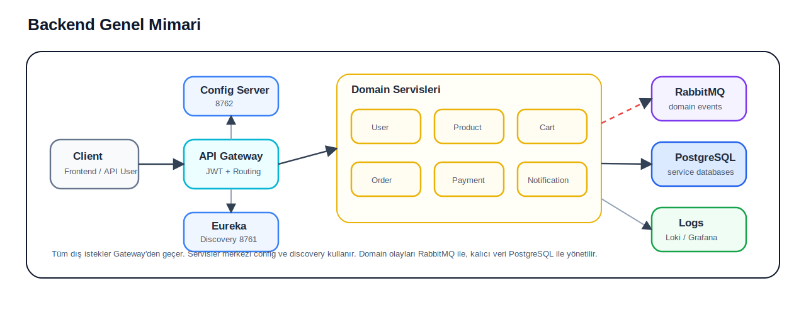
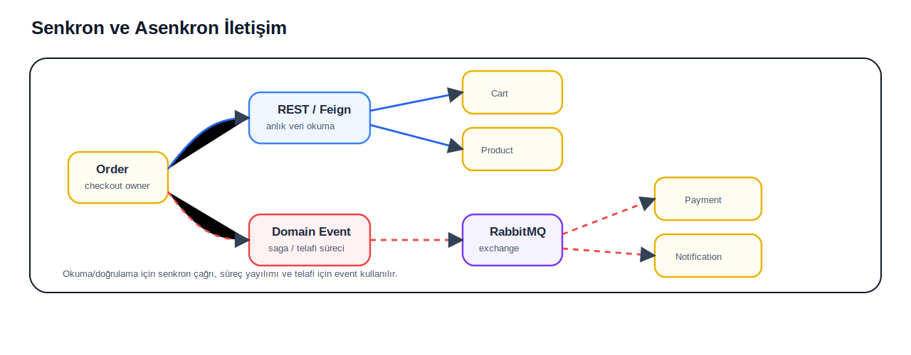
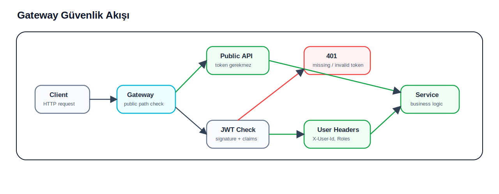
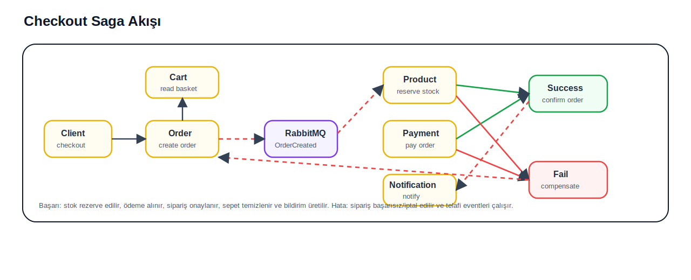

# N11 Final Case 

Canlı uygulama: http://34.107.45.87/

## 1. Proje Özeti

N11 benzeri pazaryeri sistemi için mikroservis tabanlı backend mimarisi.

Ana kapsam:

- Kullanıcı ve satıcı yönetimi
- Ürün, kategori ve stok yönetimi
- Sepet ve checkout akışı
- Sipariş, ödeme ve bildirim süreçleri
- JWT tabanlı güvenlik
- RabbitMQ ile event tabanlı iletişim
- Test, loglama, Docker ve Jenkins desteği

## 2. Teknoloji Özeti

| Alan | Teknolojiler |
| --- | --- |
| Backend | Java 21, Spring Boot |
| Mikroservis | Spring Cloud, Eureka, Config Server |
| Gateway | Spring Cloud Gateway |
| Güvenlik | Spring Security, JWT |
| İletişim | REST/Feign, RabbitMQ |
| Veritabanı | PostgreSQL |
| Test | JUnit 5, Mockito |
| İzleme | Actuator, Loki, Promtail, Grafana |
| Dağıtım | Docker Compose, Jenkins |
| Frontend | React, Vite, Nginx |

## 3. Genel Mimari

Temel mimari kararlar:

- Domain bazlı mikroservis ayrımı
- API Gateway üzerinden tek giriş noktası
- Eureka ile servis keşfi
- Config Server ile merkezi konfigürasyon
- PostgreSQL ile veri kalıcılığı
- RabbitMQ ile asenkron event iletişimi
- Loki, Promtail ve Grafana ile gözlemlenebilirlik

## 4. Servisler

### `api-gateway`

- Tek giriş noktası
- JWT doğrulama
- Route yönetimi

### `discovery-server`

- Eureka servis keşfi
- Servislerin birbirini dinamik bulması
- Sabit adres bağımlılığının azaltılması

### `config-server`

- Merkezi konfigürasyon yönetimi
- Servis ayarlarının tek merkezden yönetilmesi

### `user-service`

- Kullanıcı kayıt ve login
- Refresh token yönetimi
- Profil ve adres işlemleri
- Satıcı başvurusu
- Satıcı onay ve red süreçleri

### `product-service`

- Ürün yönetimi
- Kategori yönetimi
- Ürün arama ve filtreleme
- Stok yönetimi
- Checkout sırasında stok rezervasyonu
- Satıcı durumuna göre ürün aktivasyonu

### `cart-service`

- Aktif sepet yönetimi
- Sepete ürün ekleme
- Miktar güncelleme
- Sepet temizleme
- Sipariş sonrası sepet boşaltma

### `order-service`

- Checkout başlatma
- Sipariş oluşturma
- Sipariş durumu yönetimi
- Sipariş iptali
- Saga koordinasyonu

### `payment-service`

- Ödeme işlemleri
- Iyzico entegrasyonu
- Başarılı ödeme eventi
- Başarısız ödeme eventi
- İptal/iade telafi akışları

### `notification-service`

- Kullanıcı bildirimleri
- Okunmamış bildirimler
- Bildirim geçmişi
- WebSocket ile anlık bildirim

### `common-lib`

- Ortak DTO yapıları
- Ortak event sınıfları
- Ortak exception modelleri
- Base entity yapısı
- RabbitMQ sabitleri
- Servisler arası ortak contract yönetimi

## 5. Servisler Arası İletişim

| Model | Kullanım |
| --- | --- |
| REST / Feign | Anlık veri okuma ve doğrulama |
| RabbitMQ Event | Sipariş, stok, ödeme, bildirim ve telafi süreçleri |

Örnek akışlar:

- Checkout sırasında sepet ve kullanıcı bilgisi Feign ile alınır.
- Sipariş oluşturulduktan sonra stok, ödeme ve bildirim adımları eventlerle ilerler.
- Ödeme başarısızlığında stok telafisi event üzerinden tetiklenir.

## 6. Gateway ve Güvenlik

Gateway sorumlulukları:

- Public/protected endpoint ayrımı
- JWT token doğrulama
- Kullanıcı id bilgisini çıkarma
- Rol bilgisini çıkarma
- `X-User-Id` header aktarımı
- `X-User-Roles` header aktarımı

## 7. Checkout Saga Akışı

Checkout adımları:

1. Kullanıcı checkout başlatır.
2. `order-service` sipariş oluşturur.
3. `product-service` stok rezervasyonu yapar.
4. `payment-service` ödeme işlemini yürütür.
5. Başarılı ödeme sonrası sipariş onaylanır.
6. `cart-service` sepeti temizler.
7. `notification-service` bildirim oluşturur.

Başarısız senaryolar:

- Stok yetersizse sipariş başarısız duruma alınır.
- Ödeme başarısızsa stok telafisi yapılır.
- Sipariş iptalinde ürün, ödeme ve bildirim servisleri event ile haberdar edilir.

## 8. Veritabanı Yaklaşımı

Her servis kendi verisinden sorumludur.

| Servis | Database |
| --- | --- |
| `user-service` | `ecommerce_user_service` |
| `product-service` | `ecommerce_product_service` |
| `cart-service` | `ecommerce_cart_service` |
| `order-service` | `ecommerce_order_service` |
| `payment-service` | `ecommerce_payment_service` |
| `notification-service` | `ecommerce_notification_service` |

Temel prensip:

- Servisler başka servisin tablosuna doğrudan erişmez.
- Gerekli veri API veya event üzerinden taşınır.
- Ortak event ve DTO standartları `common-lib` içinde tutulur.

## 9.Deploy

Deploy:

- Docker Compose ile backend 
- Jenkinsfile ile otomatik deploy pipeline

## Öne çıkan noktalar:

- Mikroservis tabanlı pazaryeri backend mimarisi
- API Gateway ile merkezi güvenlik
- Domain bazlı servis ayrımı
- RabbitMQ ile event tabanlı iletişim
- Saga yaklaşımıyla checkout tutarlılığı
- Servis bazlı veritabanı sahipliği
- `common-lib` ile ortak contract yönetimi
- Test, loglama, Docker ve Jenkins desteği

